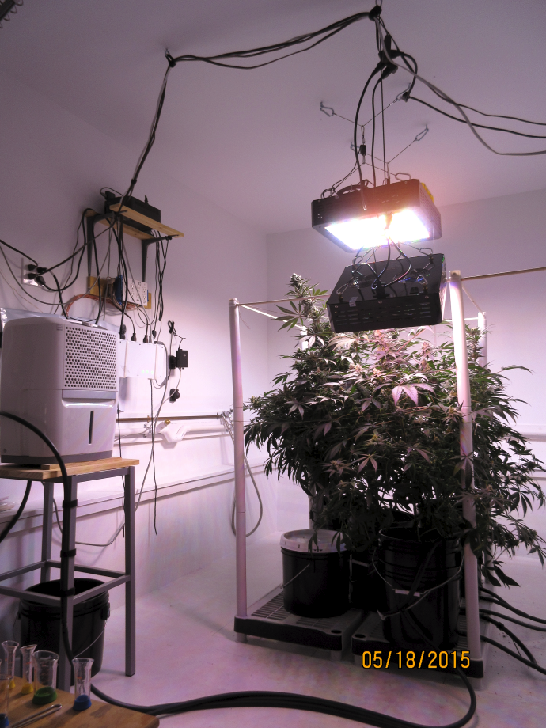

# The Humble Roots Project (v1.0)
**Home Automation Applied To Medical Cannabis Cultivation**

The *Humble Roots Project* is a grow room automation system designed to meet indoor cannabis horticulture
challenges using open software, open hardware and readily available consumer appliances. The project
blends these elements together into an inexpensive, reliable, automated system, with a focus
on sustainability.

For in-depth details about the project, check out the [project documentation](./docs/HumbleRootsProject.pdf).

This version of the project is a complete re-write of the former Python codebase in Lua.
Lua was found to provide greater reliability for long-running processes It also takes far less resources than the 
Python implementation and is ideal on low-power systems such as the Raspberry Pi.
This implementation is single-threaded to prevent potential deadlocks and race-conditions.

**Plant Growth Timelapse**

