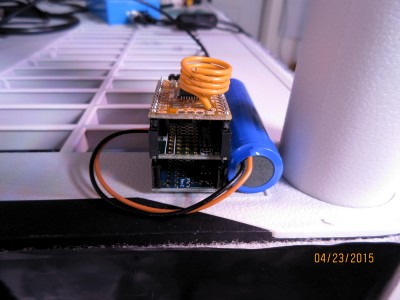
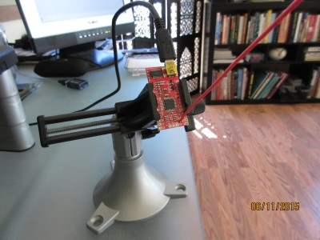
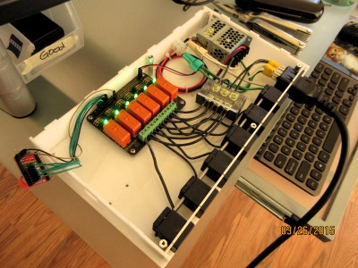
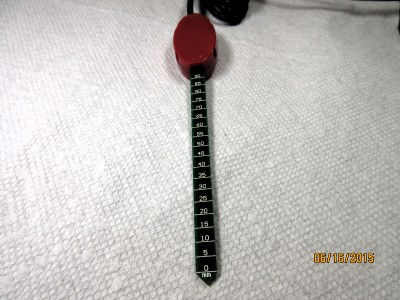
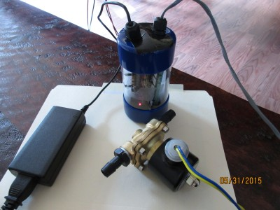
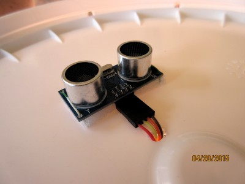

# Humble Roots Project Sketches

The various Arduino sketches provided as part of the project are intended to run on Moteino boards equipped with HopeRF RFM69W 433MHz transceivers.
The wireless nodes share a network ID but also have their own unique ID on the network.
In addition, the nodes encrypt all transmitted data using [AES-128](https://en.wikipedia.org/wiki/Advanced_Encryption_Standard).
To this end, the nodes must share a 16-byte long private key to be able to communicate with each other.
**By default, that private key is set to "&lt;YourCryptoKey!&gt;" which should be changed before compiling and uploading the sketches to the nodes.**
To do so, open the .ino files under the /arduino folder.
Then, using the 'Find...' (CTRL+F) function in the Arduino IDE, search for the default AES key and replace it with your own 16-byte long key.
Repeat this for each sketch, making sure to save all changes.

## Required Arduino Dependencies

The following libraries must be added to the Arduino IDE in order to compile the project sketches.

* [Si7021 temperature & humidity sensor library](https://github.com/LowPowerLab/SI7021)
* [BMP180 Bosch sensor library](https://github.com/LowPowerLab/SFE_BMP180)
* [RFM69 library for RFM69W and RFM69HW](https://github.com/LowPowerLab/RFM69)
* [Low Power Library for Arduino](https://github.com/LowPowerLab/LowPower)
* [PString text formating library](http://arduiniana.org/libraries/PString/)
* [EEPROMex arduino library](http://playground.arduino.cc/Code/EEPROMex)

# Bill of materials

The Arduino sketches provided with the Humble Root Project are designed to run on the following hardware or equivalent.

## Climate node



* 1x [Moteino MCU](https://lowpowerlab.com/shop/index.php?_route_=moteino-r4)
* 1x [Transceiver (RFM69W @ 433MHz)](https://lowpowerlab.com/shop/index.php?_route_=Moteino/RFM69W)
* 1x [Power Shield](https://lowpowerlab.com/shop/index.php?_route_=powershield)
* 1x [WeatherShield](https://lowpowerlab.com/shop/index.php?_route_=weathershield)
* 1x [Lithium Ion Cylindrical Battery - 3.7v 2200mAh](http://www.adafruit.com/products/1781)

## Gateway node



* 1x [Moteino USB MCU](https://lowpowerlab.com/shop/index.php?_route_=Moteino/moteinousb)
* 1x [Transceiver (RFM69W @ 433MHz)](https://lowpowerlab.com/shop/index.php?_route_=Moteino/RFM69W)
* 1x Mini USB cable
* 1x Computer capable of running Python 2.7.x

The Humble Roots Project Python code has been tested on the following systems

* [Ubuntu 14.04 (Desktop)](http://www.ubuntu.com/download/desktop)
* [Raspberry Pi (Debian Wheezy)](https://www.raspberrypi.org/downloads/)
* [BeagleBone Black (Ubuntu)](http://elinux.org/BeagleBoardUbuntu)

## Relay node




**Warning: the relay node switches high voltages and currents!**
**You must be comfortable working with high power before attempting to build this node.**
**Please seek help if you are unsure about the safety precautions needed when working with high power.**

* 1x [Moteino MCU](https://lowpowerlab.com/shop/index.php?_route_=moteino-r4)
* 1x [Transceiver (RFM69W @ 433MHz)](https://lowpowerlab.com/shop/index.php?_route_=Moteino/RFM69W)
* 1x [Humble Roots Project Relay Board](../hardware)
* 6x [Schurter AC Power Entry Modules SNAP-IN QC/WIRE NEMA](http://www.mouser.com/ProductDetail/Schurter/43000703/?qs=%2fha2pyFaduhBCtkGZdsCVlhWWizSnRMPw8sJ%2fGTwrMM%3d)
* 1x [Schurter AC Power Entry Modules 1.2mm Snap-In INLET 16A](http://www.mouser.com/ProductDetail/Schurter/47938000/?qs=%2fha2pyFaduhGWt2JM6mVJBsIsAazDcRYIle0WaEJEYg%3d)
* 1x [5V 15W 1 Phase Switching Power Supply](http://www.mouser.com/ProductDetail/Delta-Electronics/PMC-05V015W1AA/?qs=%2fha2pyFaduizDshZ3pRHk%252b4oUL4ABMASMDXLfTCPQpmGsWLxuiTqMg%3d%3d)
* 1x [Schurter AC Power Cord IEC320 16A 2.0m V-Lock](http://www.mouser.com/ProductDetail/Schurter/60512047/?qs=%2fha2pyFadujHgsyMbK9CuAgas3C%2fAR3tHzhqGgnq5LWE1rj9bAwi2g%3d%3d)
* 1x 12 AWG solid core wire spool (black)
* 1x 12 AWG solid core wire spool (green)
* 1x 12 AWG solid core wire spool (white)
* 1x 12 AWG stranded wire spool (black)
* 1x 12-10 AWG 6-Circuit Terminal Block
* 3x Winged Twist Wire Connectors
* 3x 12-10 AWG 0.25 in. Tab Female Fully-Insulated Disconnects
* 1x 24 AWG stranded prototyping wire (red)
* 1x 24 AWG stranded prototyping wire (black)

Note: any relay board with at least 6 channels capable of handling loads ranging from 10A to 16A @ 240V will work.

## Soil Relative Humidity Node



* 1x [Moteino MCU](https://lowpowerlab.com/shop/index.php?_route_=moteino-r4)
* 1x [Transceiver (RFM69W @ 433MHz)](https://lowpowerlab.com/shop/index.php?_route_=Moteino/RFM69W)
* 1x [MightyBoost](https://lowpowerlab.com/shop/index.php?_route_=mightyboost)
* 1x [Lithium Ion Battery Pack - 3.7V 6600mAh](http://www.adafruit.com/products/353)
* 1x [VH400 Soil Moisture Sensor Probe](http://www.vegetronix.com/Products/VH400/)

## Valve node



**Warning: the 'valve' node switches high currents!**
**You must be comfortable working with high power before attempting to build this node.**
**Please seek help if you are unsure about the safety precautions needed when working with high power.**

* 1x [Moteino MCU](https://lowpowerlab.com/shop/index.php?_route_=moteino-r4)
* 1x [Transceiver (RFM69W @ 433MHz)](https://lowpowerlab.com/shop/index.php?_route_=Moteino/RFM69W)
* 1x [Humble Roots Project Solenoid Control Board](../hardware)
* 1x [12V 5A Switching Power Supply](http://www.adafruit.com/product/352)
* 1x [Brass Liquid Solenoid Valve - 12V - 1/2 NPS](http://www.adafruit.com/products/996)
* 1x 18 AWG stranded wire (spool)

## Water Level nodes



Two 'water level' nodes are used as part of the project as share the same code.
However, the network IDs for the two nodes are different and must be edited before compiling and uploading the code.

* A 'sump' node (ID=4)
* A 'tank' node (ID=30)

Start by loading the [waterlevel.ino sketch](./waterlevel/waterlevel.ino) in the Arduino IDE.

Locate the following line, ensuring that the node ID is set to 4.

```
	#define THIS_NODE_ID             4
```

Compile the sketch and upload it to the Moteino node used for the 'sump' node.

Then, set the node ID to 30.

```
	#define THIS_NODE_ID             30
```

Compile the sketch again and upload it to the Moteino node used for the 'tank' node.

* 1x [Moteino MCU](https://lowpowerlab.com/shop/index.php?_route_=moteino-r4)
* 1x [Transceiver (RFM69W @ 433MHz)](https://lowpowerlab.com/shop/index.php?_route_=Moteino/RFM69W)
* 1x [HC-SR04 ultrasonic sensor](https://lowpowerlab.com/shop/index.php?_route_=HC-SR04)
* 1x [SparkFun micro B USB Breakout](https://www.sparkfun.com/products/12035)
* 1x [5V 1A (1000mA) USB port power supply](http://www.adafruit.com/products/501)
* 1x Micro B USB cable
